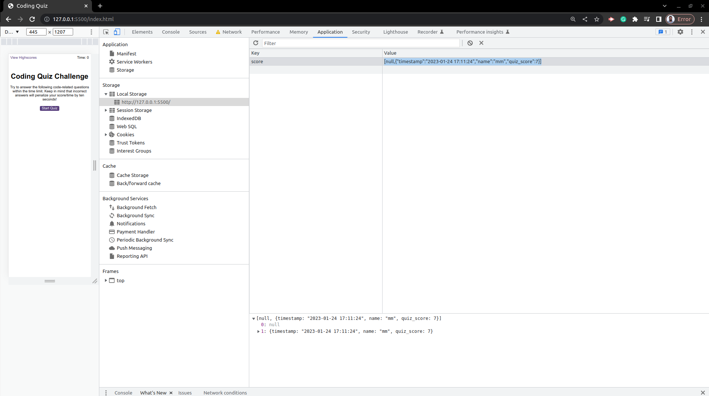

# code_quiz

## description 
This project is to create a quiz game. The code imports a function called "get_questions" from a separate file "questions.js" to get quiz and global variables.It also selects several HTML elements on the page such as the timer, question title, and quiz choices, and creates elements for displaying the quiz questions and feedback. 

The code also includes an event listener for when the quiz ends, which calls the "create_feedback_table" function and displays the results of the quiz in a table. It also includes "set_feedback" function which will redirect user to highscores page after 5 sec.

some of the issues that I found during the coding;

- found additional null element in the Array while using forEach loop 

### credits
[Array](https://developer.mozilla.org/en-US/docs/Web/JavaScript/Reference/Global_Objects/Array)

[Map](https://developer.mozilla.org/en-US/docs/Web/JavaScript/Reference/Global_Objects/Map)

[import modules](https://softauthor.com/javascript-cannot-use-import-statement-outside-a-module/)

[Node isConnected](https://developer.mozilla.org/en-US/docs/Web/API/Node/isConnected)

[use object.create instead new](https://developer.mozilla.org/en-US/docs/Web/JavaScript/Reference/Global_Objects/Object/create)

[throw](https://developer.mozilla.org/en-US/docs/Web/JavaScript/Reference/Statements/throw)